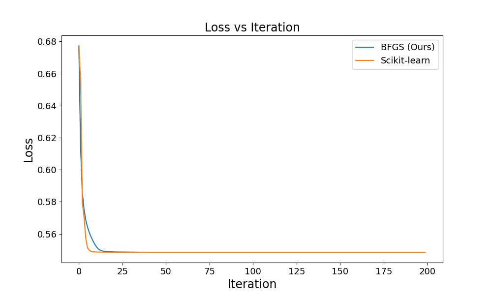

# Optimization Algorithms - Analysis

This repository contains experiments with various optimization algorithms, evaluating their performance with and without regularization techniques.

| **Algorithm**                | **None** | **L1** | **L2** | **Backtracking** |
|------------------------------|---------|--------|--------|-----------------|
| Gradient Descent              | ✓       | ✓      | ✓      | ✓               |
| Stochastic Gradient Descent   | ✓       | ✓      | ✓      |                 |
| Batch Gradient Descent        | ✓       | ✓      | ✓      |                 |
| Accelerated Gradient Descent  | ✓       | ✓      | ✓      |                 |
| Newton's Method               | ✓       |        | ✓      | ✓               |
| BFGS                          | ✓       |        | ✓      |                 |
| Adam                          | ✓       | ✓      | ✓      |                 |

**Comparison of BFGS (Ours) with Scikit-learn shows that our algorithm reduces runtime by approximately 50% compared to Scikit-learn, while maintaining a high accuracy score.**


## 1. Dataset & Transformation

The [Synthetic Employee Attrition Dataset](https://www.kaggle.com/datasets/stealthtechnologies/employee-attrition-dataset) is used for model analysis. This dataset simulates employee attrition and includes detailed features related to demographics, job details, and personal circumstances.

### Dataset Overview:
- **Size:** 74,498 samples
- **Splits:** Training and Testing
- **Features:** Demographics, job-related, personal, etc.
- **Task:** Predict employee attrition

### Data Transformation:
- **Categorical Features:** Encoded using `LabelEncoder`
- **Numerical Features:** Scaled using `StandardScaler`

## 2. Installation & Setup

### Clone the Repository:
```bash
git clone https://github.com/QuyAnh2005/optimization-algorithms-analysis.git
```

### [Optional] Create a Virtual Environment:
```bash
python -m venv venv
source venv/bin/activate  # On Windows: venv\Scripts\activate
```

### Install Dependencies:
```bash
pip install -r requirements.txt
```

## 3. Example Usage

```python
import numpy as np
from core.model import LogisticRegression

# Initialize the Logistic Regression model with a specified solver
algo = 'gradient-descent'
log_reg = LogisticRegression(solver=algo)

# Sample data for X and y
X = np.array([[1, 2], [2, 3], [3, 4], [4, 5], [5, 6]])
y = np.array([0, 1, 0, 1, 0]).reshape(-1, 1)

# Fit the model to the data
log_reg.fit(X, y)
```
## 3. Test Modules
To test modules, you need install `pytest`
```
pip install pytest
pytest test/

### EXAMPLE OUTPUT ###
======================================================================== test session starts =========================================================================
# platform linux -- Python 3.10.12, pytest-8.2.0, pluggy-1.5.0
# rootdir: /home/quyanh/Projects/Optimization Algo
# plugins: anyio-4.3.0, time-machine-2.14.1, Faker-24.11.0, typeguard-4.2.1
# collected 7 items                                                                                                                                                    

# test/test_accelerared.py .                                                                                                                                     [ 14%]
# test/test_adam.py .                                                                                                                                            [ 28%]
# test/test_bfgs.py .                                                                                                                                            [ 42%]
# test/test_common.py .                                                                                                                                          [ 57%]
# test/test_gd.py .                                                                                                                                              [ 71%]
# test/test_newton.py .                                                                                                                                          [ 85%]
# test/test_sgd.py .                                                                                                                                             [100%]

# ========================================================================= 7 passed in 0.47s ==========================================================================
```
